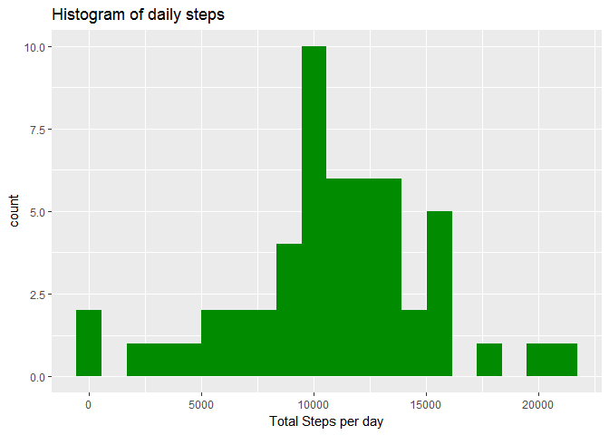
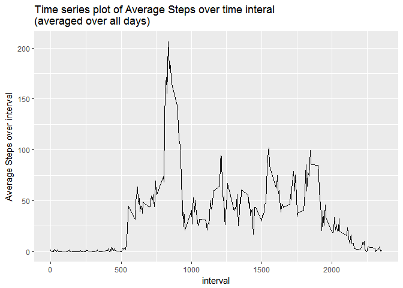
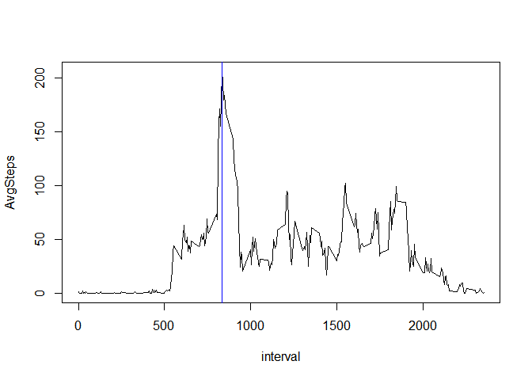
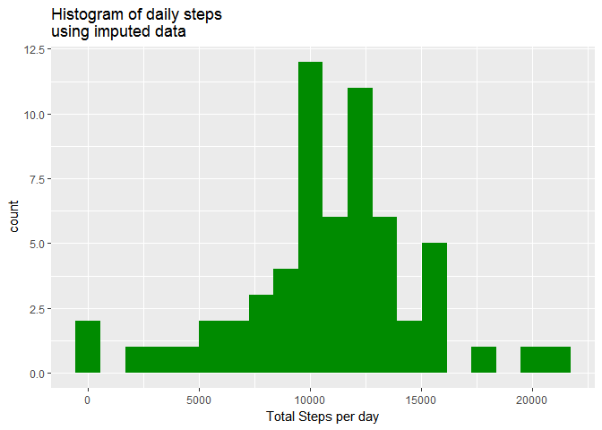
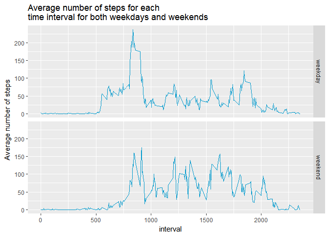

# Reproducible Research: Peer Assessment 1

## Load packages


```r
library(magrittr)
library(dplyr)
library(ggplot2)
library(readr)
```

## Loading and preprocessing the data


```r
file<-read_csv("activity.csv")%>%as.data.frame
```


## What is mean total number of steps taken per day?


```r
stepsDaily<-file[complete.cases(file),]%>%group_by(date)%>%summarize(TotalSteps=sum(steps))%>%as.data.frame
```


```r
ggplot(stepsDaily,aes(x=TotalSteps))+geom_histogram(fill="green4",bins=20)+labs(title="Histogram of daily steps",x="Total Steps per day")
```

<!-- -->

```r
cat("The mean total number of daily steps is ",round(mean(stepsDaily$TotalSteps),2),"\n")
```

```
## The mean total number of daily steps is  10766.19
```

```r
cat("The median total number of daily steps is ",round(median(stepsDaily$TotalSteps),2),"\n")
```

```
## The median total number of daily steps is  10765
```
## What is the average daily activity pattern?


```r
avgStepsEachInterval<-file[complete.cases(file),]%>%group_by(interval)%>%summarize(AvgSteps=mean(steps))
```


```r
ggplot(avgStepsEachInterval,aes(x=interval,y=AvgSteps))+geom_line()+labs(y="Average Steps over interval",title="Time series plot of Average Steps over time interal\n(averaged over all days)")
```

<!-- -->


```r
intervalWithHighestNumAvgSteps<-avgStepsEachInterval[which(avgStepsEachInterval$AvgSteps==max(avgStepsEachInterval$AvgSteps)),1]
intervalWithHighestNumAvgSteps
```

```
## # A tibble: 1 × 1
##   interval
##      <int>
## 1      835
```
Below we'll redo the time-series plot showing the interval with the highest average number of steps.


```r
avgStepsEachInterval<-avgStepsEachInterval%>%arrange(interval)
with(avgStepsEachInterval,plot(interval,AvgSteps,type="l"))
abline(v=intervalWithHighestNumAvgSteps,col="blue")
```

<!-- -->

## Imputing missing values
Note that there are a number of days/intervals where there are missing values (coded as NA). The presence of missing days may introduce bias into some calculations or summaries of the data.

    Calculate and report the total number of missing values in the dataset (i.e. the total number of rows with NAs)


```r
totalNumRowsWithMissingVals<-sum(!complete.cases(file))
totalNumRowsWithMissingVals
```

```
## [1] 2304
```

    Devise a strategy for filling in all of the missing values in the dataset. The strategy does not need to be sophisticated. For example, you could use the mean/median for that day, or the mean for that 5-minute interval, etc.

    Create a new dataset that is equal to the original dataset but with the missing data filled in.

### Imputation Strategy

**It seems reasonable to me that the number of steps that this individual would take at a particular 5-minute time interval on a particular day of the week (e.g. Monday, Sunday) would be not show an enormous amount of variability. This is in accord with our diurnal naturnal rhythm juxtaposed alongside the workweek rhythm.So I'll replace any missing value by the mean  for that day-of-the-week time/interval pair. Though the histogram of total daily steps for the dataset being left-skewed would seem to indicate that the median would be a superior measure of center to the mean, the bulk of the time intervals in this dataset have step count of zero.**


```r
quantile(file$steps,seq(0,1,0.1),na.rm=T)
```

```
##   0%  10%  20%  30%  40%  50%  60%  70%  80%  90% 100% 
##    0    0    0    0    0    0    0    0   28   86  806
```
**So we'd certainly expect the bulk of the medians of each day-of-the-week/interval pairings to be zero, so the median isn't going to be terribly useful in this situation.**

**Details of the imputation:**   
1.  A column is added for the day of the week  
2.  Data is grouped by day of the week and interval  
3.  An column with the average number of steps taken for each day-of-the-week/interval pairing is added.  
4.  Missing values of steps are imputed as the rounded average value for their day-of-the-week/interval grouping. The rounding is to force datatype compatibility with the original data.


```r
imputed<-file%>%mutate_(dayOfWeek = ~weekdays(date))%>%group_by(dayOfWeek,interval)%>%mutate_(avg = ~mean(steps,na.rm=T))%>%mutate_(steps = ~ifelse(is.na(steps),as.integer(round(avg)),steps))%>%ungroup()%>%select(-c(avg,dayOfWeek))

cat("Here's a check that the dimensions of the new data frame match the original one","\n",sep="")
```

```
## Here's a check that the dimensions of the new data frame match the original one
```

```r
cat("original data dimensions:",dim(file)[1]," ",dim(file)[2],"\n",sep="")
```

```
## original data dimensions:17568 3
```

```r
cat("imputed data dimensions:",dim(imputed)[1]," ",dim(imputed)[2],"\n",sep="")
```

```
## imputed data dimensions:17568 3
```


```r
totalDailyImputed<-imputed%>%group_by(date)%>%summarize(TotalSteps=sum(steps))%>%as.data.frame

ggplot(totalDailyImputed,aes(x=TotalSteps))+geom_histogram(fill="green4",bins=20)+labs(title="Histogram of daily steps \nusing imputed data",x="Total Steps per day")
```

<!-- -->

```r
cat("The mean of the total daily steps of the imputed data is ",round(mean(totalDailyImputed$TotalSteps),2),"\n",sep="")
```

```
## The mean of the total daily steps of the imputed data is 10821.1
```

```r
cat("The median of the total daily steps of the imputed data is ",round(median(totalDailyImputed$TotalSteps),2),"\n",sep="")
```

```
## The median of the total daily steps of the imputed data is 11015
```

Graphically the impact of imputing the missing data is that the histogram of daily total steps becomes somewhat bimodal. The impact to the measures of center are that both the mean and median total daily steps go up slightly.

## Are there differences in activity patterns between weekdays and weekends?


```r
imputedwkdayWknd<-imputed%>%mutate(weekPart=ifelse(weekdays(date)%in% c("Saturday","Sunday"),"weekend","weekday")%>%as.factor)


avgsForTimeIntervalAndweekPart<-imputedwkdayWknd%>%group_by(weekPart,interval)%>%summarize(avg=mean(steps))

ggplot(avgsForTimeIntervalAndweekPart,aes(x=interval,y=avg))+geom_line(col="deepskyblue3")+facet_grid(weekPart~.)+labs(title="Average number of steps for each\ntime interval for both weekdays and weekends",y="Average number of steps")
```

<!-- -->

As a big picture view, this individual's activity patterns seem to fairly similar between weekdays and weekends. On weekdays, (s)he gets moving a bit earlier. However, on weekends, (s)he remains active active through a much larger share of the day.
